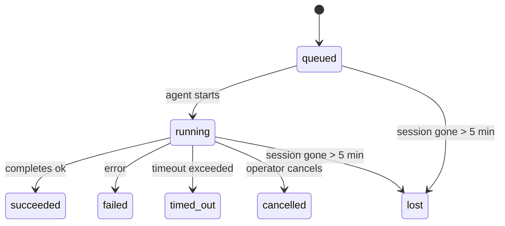

---
read_when:
    - 检查正在进行中或最近完成的后台工作
    - 调试脱离当前会话的智能体运行的交付失败问题
    - 了解后台运行如何与会话、cron 和 Heartbeat 相关联
summary: 用于 ACP 运行、子智能体、隔离 cron 作业和 CLI 操作的后台任务跟踪
title: 后台任务
x-i18n:
    generated_at: "2026-04-08T03:40:34Z"
    model: gpt-5.4
    provider: openai
    source_hash: 2f56c1ac23237907a090c69c920c09578a2f56f5d8bf750c7f2136c603c8a8ff
    source_path: automation\tasks.md
    workflow: 15
---

# 后台任务

> **在找调度功能？** 请参阅 [自动化与任务](/zh-CN/automation) 以选择合适的机制。本页介绍的是后台工作的**跟踪**，而不是调度。

后台任务用于跟踪**在你的主对话会话之外**运行的工作：
ACP 运行、子智能体生成、隔离 cron 作业执行以及由 CLI 发起的操作。

任务**不会**替代会话、cron 作业或 heartbeat —— 它们是记录脱离当前会话工作发生了什么、何时发生以及是否成功的**活动台账**。

<Note>
并非每次智能体运行都会创建任务。Heartbeat 轮次和普通交互式聊天不会创建任务。所有 cron 执行、ACP 生成、子智能体生成以及 CLI 智能体命令都会创建任务。
</Note>

## TL;DR

- 任务是**记录**，不是调度器 —— cron 和 heartbeat 决定工作**何时**运行，任务负责跟踪**发生了什么**。
- ACP、子智能体、所有 cron 作业以及 CLI 操作都会创建任务。Heartbeat 轮次不会。
- 每个任务都会经历 `queued → running → terminal`（succeeded、failed、timed_out、cancelled 或 lost）。
- 只要 cron 运行时仍拥有该作业，cron 任务就会保持活动状态；而基于聊天的 CLI 任务仅在其所属运行上下文仍处于活动状态时才会保持活动状态。
- 完成采用推送驱动：脱离当前会话的工作完成后可以直接通知，或唤醒请求者会话 / heartbeat，因此状态轮询循环通常不是正确方式。
- 隔离 cron 运行和子智能体完成时，会在最终清理记账前尽力清理其子会话所跟踪的浏览器标签页 / 进程。
- 隔离 cron 交付会在后代子智能体工作仍在排空时抑制过时的中间父级回复，并优先使用先于交付到达的最终后代输出。
- 完成通知会直接发送到渠道，或排队等待下一个 heartbeat。
- `openclaw tasks list` 显示所有任务；`openclaw tasks audit` 用于发现问题。
- 终态记录会保留 7 天，之后自动清理。

## 快速开始

```bash
# List all tasks (newest first)
openclaw tasks list

# Filter by runtime or status
openclaw tasks list --runtime acp
openclaw tasks list --status running

# Show details for a specific task (by ID, run ID, or session key)
openclaw tasks show <lookup>

# Cancel a running task (kills the child session)
openclaw tasks cancel <lookup>

# Change notification policy for a task
openclaw tasks notify <lookup> state_changes

# Run a health audit
openclaw tasks audit

# Preview or apply maintenance
openclaw tasks maintenance
openclaw tasks maintenance --apply

# Inspect TaskFlow state
openclaw tasks flow list
openclaw tasks flow show <lookup>
openclaw tasks flow cancel <lookup>
```

## 什么会创建任务

| 来源 | 运行时类型 | 何时创建任务记录 | 默认通知策略 |
| ---------------------- | ------------ | ------------------------------------------------------ | --------------------- |
| ACP 后台运行 | `acp` | 生成 ACP 子会话时 | `done_only` |
| 子智能体编排 | `subagent` | 通过 `sessions_spawn` 生成子智能体时 | `done_only` |
| cron 作业（所有类型） | `cron` | 每次 cron 执行时（主会话和隔离会话均包括） | `silent` |
| CLI 操作 | `cli` | 通过 Gateway 网关运行的 `openclaw agent` 命令 | `silent` |
| 智能体媒体作业 | `cli` | 基于会话的 `video_generate` 运行 | `silent` |

主会话 cron 任务默认使用 `silent` 通知策略 —— 它们会创建记录用于跟踪，但不会生成通知。隔离 cron 任务默认也是 `silent`，但由于它们在自己的会话中运行，因此可见性更高。

基于会话的 `video_generate` 运行同样使用 `silent` 通知策略。它们仍然会创建任务记录，但完成后会通过内部唤醒交还给原始智能体会话，以便智能体自行编写后续消息并附加已完成的视频。如果你启用了 `tools.media.asyncCompletion.directSend`，异步 `music_generate` 和 `video_generate` 完成时会先尝试直接发送到渠道，若失败则回退到唤醒请求者会话的路径。

当基于会话的 `video_generate` 任务仍处于活动状态时，该工具还会充当防护机制：在同一会话中重复调用 `video_generate` 时，会返回活动任务状态，而不是启动第二个并发生成任务。当你希望从智能体侧显式查询进度 / 状态时，请使用 `action: "status"`。

**不会创建任务的情况：**

- Heartbeat 轮次 —— 主会话；参见 [Heartbeat](/zh-CN/gateway/heartbeat)
- 普通交互式聊天轮次
- 直接 `/command` 响应

## 任务生命周期



| 状态 | 含义 |
| ----------- | -------------------------------------------------------------------------- |
| `queued` | 已创建，等待智能体启动 |
| `running` | 智能体轮次正在主动执行 |
| `succeeded` | 已成功完成 |
| `failed` | 因错误而完成 |
| `timed_out` | 超过已配置的超时时间 |
| `cancelled` | 由操作员通过 `openclaw tasks cancel` 停止 |
| `lost` | 运行时在 5 分钟宽限期后丢失了权威性后端状态 |

状态转换会自动发生 —— 当关联的智能体运行结束时，任务状态会更新为相应结果。

`lost` 具有运行时感知能力：

- ACP 任务：其后端 ACP 子会话元数据已消失。
- 子智能体任务：其后端子会话已从目标智能体存储中消失。
- cron 任务：cron 运行时不再将该作业视为活动状态。
- CLI 任务：隔离子会话任务使用子会话；基于聊天的 CLI 任务则改用活动运行上下文，因此残留的渠道 / 群组 / 直接会话行不会让它们继续保持活动状态。

## 交付与通知

当任务进入终态时，OpenClaw 会通知你。共有两种交付路径：

**直接交付** —— 如果任务具有渠道目标（即 `requesterOrigin`），完成消息会直接发送到该渠道（Telegram、Discord、Slack 等）。对于子智能体完成，OpenClaw 也会在可用时保留绑定的线程 / 主题路由，并且可以在直接交付前，使用请求者会话中存储的路由（`lastChannel` / `lastTo` / `lastAccountId`）补全缺失的 `to` / account。

**会话排队交付** —— 如果直接交付失败，或者未设置来源，则该更新会作为系统事件排入请求者会话，并在下一次 heartbeat 时显示出来。

<Tip>
任务完成会立即触发一次 heartbeat 唤醒，因此你能快速看到结果 —— 无需等待下一次计划 heartbeat 触发。
</Tip>

这意味着常见工作流是基于推送的：启动一次脱离当前会话的工作，然后让运行时在完成时唤醒你或通知你。只有在你需要调试、人工干预或显式审计时，才应轮询任务状态。

### 通知策略

控制你希望收到多少关于每个任务的信息：

| 策略 | 交付内容 |
| --------------------- | ----------------------------------------------------------------------- |
| `done_only`（默认） | 仅终态（succeeded、failed 等）—— **这是默认值** |
| `state_changes` | 每次状态变更和进度更新 |
| `silent` | 完全不通知 |

可在任务运行过程中修改策略：

```bash
openclaw tasks notify <lookup> state_changes
```

## CLI 参考

### `tasks list`

```bash
openclaw tasks list [--runtime <acp|subagent|cron|cli>] [--status <status>] [--json]
```

输出列：任务 ID、类型、状态、交付方式、运行 ID、子会话、摘要。

### `tasks show`

```bash
openclaw tasks show <lookup>
```

查找令牌支持任务 ID、运行 ID 或会话键。显示完整记录，包括时间、交付状态、错误和终态摘要。

### `tasks cancel`

```bash
openclaw tasks cancel <lookup>
```

对于 ACP 和子智能体任务，这会终止子会话。状态将变为 `cancelled`，并发送交付通知。

### `tasks notify`

```bash
openclaw tasks notify <lookup> <done_only|state_changes|silent>
```

### `tasks audit`

```bash
openclaw tasks audit [--json]
```

用于发现运维问题。检测到问题时，结果也会显示在 `openclaw status` 中。

| 发现项 | 严重级别 | 触发条件 |
| ------------------------- | -------- | ----------------------------------------------------- |
| `stale_queued` | warn | 已排队超过 10 分钟 |
| `stale_running` | error | 已运行超过 30 分钟 |
| `lost` | error | 运行时后端任务所有权已消失 |
| `delivery_failed` | warn | 交付失败且通知策略不是 `silent` |
| `missing_cleanup` | warn | 已进入终态但没有清理时间戳的任务 |
| `inconsistent_timestamps` | warn | 时间线冲突（例如结束时间早于开始时间） |

### `tasks maintenance`

```bash
openclaw tasks maintenance [--json]
openclaw tasks maintenance --apply [--json]
```

使用此命令可预览或应用任务及 Task Flow 状态的对账、清理时间戳设置和清除。

对账具有运行时感知能力：

- ACP / 子智能体任务会检查其后端子会话。
- cron 任务会检查 cron 运行时是否仍拥有该作业。
- 基于聊天的 CLI 任务会检查所属的活动运行上下文，而不只是聊天会话行。

完成后的清理也具有运行时感知能力：

- 子智能体完成时，会在继续完成通知清理前，尽力关闭该子会话所跟踪的浏览器标签页 / 进程。
- 隔离 cron 完成时，会在运行彻底结束前，尽力关闭 cron 会话所跟踪的浏览器标签页 / 进程。
- 隔离 cron 交付会在需要时等待后代子智能体的后续处理完成，并抑制过时的父级确认文本，而不是宣布它。
- 子智能体完成交付会优先使用最新的可见助手文本；如果该文本为空，则回退到已净化的最新 tool / toolResult 文本，而仅包含超时工具调用的运行则可折叠为简短的部分进度摘要。
- 清理失败不会掩盖任务的真实结果。

### `tasks flow list|show|cancel`

```bash
openclaw tasks flow list [--status <status>] [--json]
openclaw tasks flow show <lookup> [--json]
openclaw tasks flow cancel <lookup>
```

当你关注的是编排层 Task Flow，而不是单个后台任务记录时，请使用这些命令。

## 聊天任务面板（`/tasks`）

在任意聊天会话中使用 `/tasks` 可查看与该会话关联的后台任务。该面板会显示活动中和最近完成的任务，以及其运行时、状态、时间和进度或错误详情。

当当前会话没有可见的关联任务时，`/tasks` 会回退为智能体本地任务计数，这样你仍可获得概览，同时不会泄露其他会话的详细信息。

如需完整的操作员台账，请使用 CLI：`openclaw tasks list`。

## 状态集成（任务压力）

`openclaw status` 包含一个任务摘要，便于快速查看：

```
Tasks: 3 queued · 2 running · 1 issues
```

摘要会报告：

- **active** —— `queued` + `running` 的数量
- **failures** —— `failed` + `timed_out` + `lost` 的数量
- **byRuntime** —— 按 `acp`、`subagent`、`cron`、`cli` 分类的明细

`/status` 和 `session_status` 工具都使用具备清理感知能力的任务快照：优先显示活动任务，隐藏陈旧的已完成行，只有在没有活动工作残留时才显示最近失败项。这能让状态卡聚焦于当前真正重要的内容。

## 存储与维护

### 任务存储位置

任务记录会持久化到以下 SQLite 位置：

```
$OPENCLAW_STATE_DIR/tasks/runs.sqlite
```

注册表会在 Gateway 网关启动时加载到内存中，并将写入同步到 SQLite，以保证重启后的持久性。

### 自动维护

清扫器每 **60 秒** 运行一次，处理以下三件事：

1. **对账** —— 检查活动任务是否仍具有权威性的运行时后端。ACP / 子智能体任务使用子会话状态，cron 任务使用活动作业所有权，基于聊天的 CLI 任务使用所属运行上下文。如果该后端状态消失超过 5 分钟，任务将被标记为 `lost`。
2. **清理时间戳设置** —— 为终态任务设置 `cleanupAfter` 时间戳（`endedAt + 7 days`）。
3. **清除** —— 删除超过其 `cleanupAfter` 日期的记录。

**保留期**：终态任务记录会保留 **7 天**，之后自动清除。无需任何配置。

## 任务与其他系统的关系

### 任务与 Task Flow

[???](/zh-CN/automation/taskflow) 是位于后台任务之上的流程编排层。单个流程可以在其生命周期内使用托管或镜像同步模式来协调多个任务。使用 `openclaw tasks` 检查单个任务记录，使用 `openclaw tasks flow` 检查编排流程。

详情请参阅 [???](/zh-CN/automation/taskflow)。

### 任务与 cron

cron 作业**定义**存储在 `~/.openclaw/cron/jobs.json` 中。**每一次** cron 执行都会创建任务记录 —— 包括主会话和隔离会话。主会话 cron 任务默认使用 `silent` 通知策略，因此它们会被跟踪，但不会生成通知。

参见 [????](/zh-CN/automation/cron-jobs)。

### 任务与 heartbeat

Heartbeat 运行属于主会话轮次 —— 它们不会创建任务记录。任务完成时，它可以触发 heartbeat 唤醒，以便你及时看到结果。

参见 [Heartbeat](/zh-CN/gateway/heartbeat)。

### 任务与会话

任务可能引用 `childSessionKey`（工作运行的位置）和 `requesterSessionKey`（谁发起了该任务）。会话是对话上下文；任务则是在其之上的活动跟踪。

### 任务与智能体运行

任务的 `runId` 会链接到执行该工作的智能体运行。智能体生命周期事件（开始、结束、错误）会自动更新任务状态 —— 你无需手动管理生命周期。

## 相关内容

- [自动化与任务](/zh-CN/automation) — 所有自动化机制一览
- [???](/zh-CN/automation/taskflow) — 位于任务之上的流程编排
- [计划任务](/zh-CN/automation/cron-jobs) — 调度后台工作
- [Heartbeat](/zh-CN/gateway/heartbeat) — 周期性主会话轮次
- [CLI???](/zh-CN/cli/index#tasks) — CLI 命令参考
