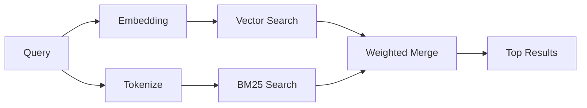

---
read_when:
    - 你想了解 `memory_search` 的工作方式
    - 你想选择一个嵌入提供商
    - 你想调整搜索质量
summary: 记忆搜索如何使用嵌入和混合检索来查找相关笔记
title: 记忆搜索
x-i18n:
    generated_at: "2026-04-08T04:02:04Z"
    model: gpt-5.4
    provider: openai
    source_hash: b6541cd702bff41f9a468dad75ea438b70c44db7c65a4b793cbacaf9e583c7e9
    source_path: concepts\memory-search.md
    workflow: 15
---

# 记忆搜索

`memory_search` 会从你的记忆文件中查找相关笔记，即使措辞与原文不同也可以找到。它的工作方式是将记忆索引为较小的分块，然后使用嵌入、关键词或两者结合进行搜索。

## 快速开始

如果你已配置 OpenAI、Gemini、Voyage 或 Mistral API 密钥，记忆搜索会自动生效。如需显式设置提供商：

```json5
{
  agents: {
    defaults: {
      memorySearch: {
        provider: "openai", // or "gemini", "local", "ollama", etc.
      },
    },
  },
}
```

如果要使用不需要 API 密钥的本地嵌入，请使用 `provider: "local"`（需要 `node-llama-cpp`）。

## 受支持的提供商

| 提供商 | ID        | 需要 API 密钥 | 说明                                                 |
| ------ | --------- | ------------- | ---------------------------------------------------- |
| OpenAI | `openai`  | 是            | 自动检测，速度快                                     |
| Gemini | `gemini`  | 是            | 支持图像/音频索引                                    |
| Voyage | `voyage`  | 是            | 自动检测                                             |
| Mistral | `mistral` | 是           | 自动检测                                             |
| Bedrock | `bedrock` | 否           | 当 AWS 凭证链可解析时自动检测                        |
| Ollama | `ollama`  | 否            | 本地使用，必须显式设置                               |
| Local  | `local`   | 否            | GGUF 模型，下载大小约 0.6 GB                         |

## 搜索如何工作

OpenClaw 会并行运行两条检索路径，并合并结果：



- **向量搜索** 会查找语义相近的笔记（“gateway host” 可匹配“运行 OpenClaw 的机器”）。
- **BM25 关键词搜索** 会查找精确匹配项（ID、错误字符串、配置键名）。

如果只有一条路径可用（没有嵌入或没有 FTS），则仅运行另一条路径。

## 提升搜索质量

当你拥有大量笔记历史时，有两个可选功能可以提供帮助：

### 时间衰减

旧笔记的排名权重会逐渐降低，从而让较新的信息优先浮现。默认半衰期为 30 天，因此上个月的笔记分数会降至原始权重的 50%。像 `MEMORY.md` 这样的长期有效文件永远不会衰减。

<Tip>
如果你的智能体拥有数个月的每日笔记，且过时信息总是排在最近上下文之前，请启用时间衰减。
</Tip>

### MMR（多样性）

减少冗余结果。如果五条笔记都提到相同的路由器配置，MMR 会确保顶部结果覆盖不同主题，而不是重复内容。

<Tip>
如果 `memory_search` 总是从不同的每日笔记中返回几乎重复的片段，请启用 MMR。
</Tip>

### 同时启用两者

```json5
{
  agents: {
    defaults: {
      memorySearch: {
        query: {
          hybrid: {
            mmr: { enabled: true },
            temporalDecay: { enabled: true },
          },
        },
      },
    },
  },
}
```

## 多模态记忆

借助 Gemini Embedding 2，你可以将图像和音频文件与 Markdown 一起建立索引。搜索查询仍然是文本，但可以匹配视觉和音频内容。有关设置，请参见 [记忆配置参考](/zh-CN/reference/memory-config)。

## 会话记忆搜索

你还可以选择为会话转录建立索引，这样 `memory_search` 就能回忆更早之前的对话。这是通过 `memorySearch.experimental.sessionMemory` 选择启用的实验特性。详情请参见 [配置参考](/zh-CN/reference/memory-config)。

## 故障排除

**没有结果？** 运行 `openclaw memory status` 检查索引。如果为空，请运行 `openclaw memory index --force`。

**只有关键词匹配？** 你的嵌入提供商可能尚未配置。请检查 `openclaw memory status --deep`。

**找不到 CJK 文本？** 使用 `openclaw memory index --force` 重建 FTS 索引。

## 延伸阅读

- [记忆](/zh-CN/concepts/memory) —— 文件布局、后端、工具
- [记忆配置参考](/zh-CN/reference/memory-config) —— 所有配置项
