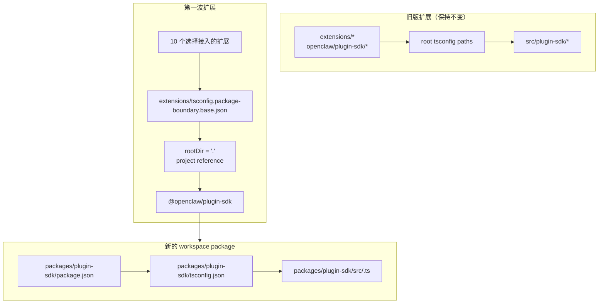

# 重构：逐步将 plugin-sdk 变成真正的 workspace package

## 概述

该计划将在
`packages/plugin-sdk` 下为插件 SDK 引入一个真正的 workspace package，并用它让第一小批扩展选择性接入
由编译器强制执行的 package 边界。目标是让针对一组选定的内置 provider
扩展的非法相对导入，在正常 `tsc` 下直接失败，而无需强制整个仓库迁移，也无需制造一个巨大的合并冲突面。

关键的渐进式动作是在一段时间内并行运行两种模式：

| 模式 | 导入形式 | 谁使用它 | 强制方式 |
| ----------- | ------------------------ | ------------------------------------ | -------------------------------------------- |
| 旧版模式 | `openclaw/plugin-sdk/*` | 所有尚未选择接入的现有扩展 | 保持当前宽松行为 |
| 选择接入模式 | `@openclaw/plugin-sdk/*` | 仅第一波扩展 | package 本地 `rootDir` + 项目引用 |

## 问题框架

当前仓库导出了一个大型公共插件 SDK 表面，但它并不是一个真正的
workspace package。而是：

- 根 `tsconfig.json` 将 `openclaw/plugin-sdk/*` 直接映射到
  `src/plugin-sdk/*.ts`
- 未选择加入上一次实验的扩展，仍然共享这种
  全局源码别名行为
- 只有在允许的 SDK 导入不再解析到 package 外部的原始仓库源码时，添加 `rootDir` 才会生效

这意味着仓库可以描述期望的边界策略，但 TypeScript
并不会对大多数扩展干净地强制执行它。

你希望有一条渐进式路径，它能够：

- 让 `plugin-sdk` 成为真正的 package
- 将 SDK 逐步迁移为一个名为 `@openclaw/plugin-sdk` 的 workspace package
- 第一版 PR 只改动大约 10 个扩展
- 其余扩展树在之后清理之前，继续停留在旧方案上
- 避免把 `tsconfig.plugin-sdk.dts.json` + 安装后生成声明文件的工作流作为第一波上线的主要机制

## 需求追踪

- R1. 在 `packages/` 下为插件 SDK 创建一个真正的 workspace package。
- R2. 将新 package 命名为 `@openclaw/plugin-sdk`。
- R3. 为新的 SDK package 提供它自己的 `package.json` 和 `tsconfig.json`。
- R4. 在迁移窗口期内，保持旧的 `openclaw/plugin-sdk/*` 导入对未选择接入的
  扩展仍然可用。
- R5. 第一版 PR 只让一小批扩展接入。
- R6. 第一波扩展必须对离开其 package 根目录的相对导入实现失败关闭。
- R7. 第一波扩展必须通过 package 依赖和 TS 项目引用来消费 SDK，
  而不是通过根级 `paths` 别名。
- R8. 该计划必须避免引入一个仓库范围内强制性的安装后生成步骤，以保证编辑器正确性。
- R9. 第一波上线必须是一个可评审、可合并的中等规模 PR，
  而不是一个涉及 300+ 文件的全仓库重构。

## 范围边界

- 第一版 PR 不进行所有内置扩展的完整迁移。
- 第一版 PR 不要求删除 `src/plugin-sdk`。
- 第一版 PR 不要求立即把所有根级构建或测试路径重接到新 package。
- 不试图为所有未选择接入的扩展都强制提供 VS Code 波浪线提示。
- 不对扩展树其余部分做大范围 lint 清理。
- 除了导入解析、package 归属，以及对已接入扩展进行边界强制之外，不做大范围运行时行为变更。

## 上下文与调研

### 相关代码与模式

- `pnpm-workspace.yaml` 已经包含 `packages/*` 和 `extensions/*`，因此在 `packages/plugin-sdk` 下新增一个
  workspace package 与现有仓库布局是契合的。
- 现有 workspace packages，如 `packages/memory-host-sdk/package.json`
  和 `packages/plugin-package-contract/package.json`，已经使用了基于 `src/*.ts` 的 package 本地
  `exports` 映射。
- 根 `package.json` 当前通过 `./plugin-sdk`
  和 `./plugin-sdk/*` exports，并基于 `dist/plugin-sdk/*.js` 与
  `dist/plugin-sdk/*.d.ts` 来发布 SDK 表面。
- `src/plugin-sdk/entrypoints.ts` 和 `scripts/lib/plugin-sdk-entrypoints.json`
  已经充当 SDK 表面的规范入口点清单。
- 根 `tsconfig.json` 当前映射：
  - `openclaw/plugin-sdk` -> `src/plugin-sdk/index.ts`
  - `openclaw/plugin-sdk/*` -> `src/plugin-sdk/*.ts`
- 上一次边界实验已经表明：只有当允许的 SDK 导入不再解析到扩展 package 之外的原始源码时，
  package 本地 `rootDir` 才能对非法相对导入生效。

### 第一波扩展集合

该计划假设第一波是 provider 偏重的那一组扩展，因为它们最不容易拖入复杂的渠道运行时边界情况：

- `extensions/anthropic`
- `extensions/exa`
- `extensions/firecrawl`
- `extensions/groq`
- `extensions/mistral`
- `extensions/openai`
- `extensions/perplexity`
- `extensions/tavily`
- `extensions/together`
- `extensions/xai`

### 第一波 SDK 表面清单

第一波扩展当前导入的是一组可控的 SDK 子路径。初始的 `@openclaw/plugin-sdk` package 只需要覆盖这些：

- `agent-runtime`
- `cli-runtime`
- `config-runtime`
- `core`
- `image-generation`
- `media-runtime`
- `media-understanding`
- `plugin-entry`
- `plugin-runtime`
- `provider-auth`
- `provider-auth-api-key`
- `provider-auth-login`
- `provider-auth-runtime`
- `provider-catalog-shared`
- `provider-entry`
- `provider-http`
- `provider-model-shared`
- `provider-onboard`
- `provider-stream-family`
- `provider-stream-shared`
- `provider-tools`
- `provider-usage`
- `provider-web-fetch`
- `provider-web-search`
- `realtime-transcription`
- `realtime-voice`
- `runtime-env`
- `secret-input`
- `security-runtime`
- `speech`
- `testing`

### 组织层面的经验教训

- 在当前工作区中，没有相关的 `docs/solutions/` 条目。

### 外部参考

- 本计划不需要外部调研。仓库中已经包含了
  相关的 workspace package 和 SDK export 模式。

## 关键技术决策

- 引入 `@openclaw/plugin-sdk` 作为新的 workspace package，同时在迁移期间保留
  旧的根级 `openclaw/plugin-sdk/*` 表面。
  理由：这样可以让第一波扩展迁移到真正的 package
  解析方式，而不必一次性强迫所有扩展和所有根级构建路径都发生变化。

- 使用一个专用的选择接入边界基础配置，例如
  `extensions/tsconfig.package-boundary.base.json`，而不是替换现有的
  通用扩展基础配置。
  理由：在迁移期间，仓库需要同时支持旧版和选择接入两种扩展模式。

- 让第一波扩展通过 TS 项目引用指向
  `packages/plugin-sdk/tsconfig.json`，并在选择接入边界模式中设置
  `disableSourceOfProjectReferenceRedirect`。
  理由：这样可以为 `tsc` 提供一个真实的 package 图，同时抑制编辑器和
  编译器回退到原始源码遍历。

- 在第一波中让 `@openclaw/plugin-sdk` 保持私有。
  理由：当前的直接目标是内部边界强制和迁移安全性，
  而不是在表面尚未稳定之前再发布一份对外的第二套 SDK 契约。

- 第一版实现只迁移第一波 SDK 子路径，其余部分保留兼容桥。
  理由：在一个 PR 中物理迁移全部 315 个 `src/plugin-sdk/*.ts` 文件，
  正是本计划想要避免的合并冲突面。

- 第一波不依赖 `scripts/postinstall-bundled-plugins.mjs` 来构建 SDK
  声明文件。
  理由：显式的构建/引用流程更容易推理，也能让仓库行为更可预测。

## 开放问题

### 已在规划阶段解决

- 第一波应该包含哪些扩展？
  使用上文列出的 10 个 provider/web-search 扩展，因为它们在结构上
  比较重的渠道 package 更独立。

- 第一版 PR 是否应该替换整个扩展树？
  不。第一版 PR 应该并行支持两种模式，并且只让第一波扩展接入。

- 第一波是否应该要求安装后声明文件构建？
  不。package/引用图应当是显式的，并且 CI 应有意识地运行
  相关的 package 本地 typecheck。

### 延后到实现阶段

- 第一波 package 是否可以仅通过项目引用直接指向 package 本地 `src/*.ts`，
  还是仍然需要为 `@openclaw/plugin-sdk` package 增加一个小型声明文件生成步骤。
  这是一个属于实现层面的 TS 图验证问题。

- 根 `openclaw` package 是否应该立刻将第一波 SDK 子路径代理到
  `packages/plugin-sdk` 输出，还是继续使用 `src/plugin-sdk` 下生成的
  兼容 shim。
  这是一个兼容性和构建形态细节问题，取决于哪种最小实现路径
  能够保持 CI 绿色。

## 高层技术设计

> 这部分用于展示预期方案，是评审的方向性指导，而不是实现规范。实现智能体应将其视为上下文，而不是需要原样复现的代码。

## 实施单元

- [ ] **单元 1：引入真正的 `@openclaw/plugin-sdk` workspace package**

**目标：**为 SDK 创建一个真正的 workspace package，使其能够承载
第一波子路径表面，而不强迫整个仓库迁移。

**需求：**R1、R2、R3、R8、R9

**依赖：**无

**文件：**

- 创建：`packages/plugin-sdk/package.json`
- 创建：`packages/plugin-sdk/tsconfig.json`
- 创建：`packages/plugin-sdk/src/index.ts`
- 创建：第一波 SDK 子路径对应的 `packages/plugin-sdk/src/*.ts`
- 修改：仅在需要调整 package glob 时修改 `pnpm-workspace.yaml`
- 修改：`package.json`
- 修改：`src/plugin-sdk/entrypoints.ts`
- 修改：`scripts/lib/plugin-sdk-entrypoints.json`
- 测试：`src/plugins/contracts/plugin-sdk-workspace-package.contract.test.ts`

**方法：**

- 添加一个名为 `@openclaw/plugin-sdk` 的新 workspace package。
- 初始仅覆盖第一波 SDK 子路径，而不是整个 315 文件树。
- 如果直接移动某个第一波入口点会造成过大的 diff，
  第一版 PR 可以先在 `packages/plugin-sdk/src` 中为该子路径引入一个薄包装器，
  然后在后续 PR 中再把该子路径簇的源码权威位置切换到 package 中。
- 复用现有入口点清单机制，使第一波 package 表面在一个规范位置中定义。
- 在 workspace package 成为新的选择接入契约的同时，保持根 package exports 对旧版用户可用。

**应遵循的模式：**

- `packages/memory-host-sdk/package.json`
- `packages/plugin-package-contract/package.json`
- `src/plugin-sdk/entrypoints.ts`

**测试场景：**

- 正常路径：workspace package 导出计划中列出的每一个第一波子路径，且没有缺失任何必需导出。
- 边界情况：当重新生成第一波入口列表或将其与规范清单比较时，package export 元数据保持稳定。
- 集成：在引入新 workspace package 后，根 package 的旧版 SDK exports 仍然存在。

**验证：**

- 仓库中存在一个有效的 `@openclaw/plugin-sdk` workspace package，具有
  稳定的第一波 export 映射，并且根 `package.json` 中没有旧版 export 回归。

- [ ] **单元 2：为 package 强制边界扩展添加选择接入 TS 边界模式**

**目标：**定义已接入扩展将使用的 TS 配置模式，
同时让现有扩展 TS 行为对其他所有扩展保持不变。

**需求：**R4、R6、R7、R8、R9

**依赖：**单元 1

**文件：**

- 创建：`extensions/tsconfig.package-boundary.base.json`
- 创建：`tsconfig.boundary-optin.json`
- 修改：`extensions/xai/tsconfig.json`
- 修改：`extensions/openai/tsconfig.json`
- 修改：`extensions/anthropic/tsconfig.json`
- 修改：`extensions/mistral/tsconfig.json`
- 修改：`extensions/groq/tsconfig.json`
- 修改：`extensions/together/tsconfig.json`
- 修改：`extensions/perplexity/tsconfig.json`
- 修改：`extensions/tavily/tsconfig.json`
- 修改：`extensions/exa/tsconfig.json`
- 修改：`extensions/firecrawl/tsconfig.json`
- 测试：`src/plugins/contracts/extension-package-project-boundaries.test.ts`
- 测试：`test/extension-package-tsc-boundary.test.ts`

**方法：**

- 保留 `extensions/tsconfig.base.json`，供旧版扩展继续使用。
- 新增一个选择接入基础配置，它：
  - 设置 `rootDir: "."`
  - 引用 `packages/plugin-sdk`
  - 启用 `composite`
  - 在需要时禁用项目引用源码重定向
- 增加一个专门的 solution 配置用于第一波 typecheck 图，
  而不是在同一个 PR 中重塑根仓库 TS 项目。

**执行说明：**在将该模式推广到全部 10 个扩展之前，
先为一个已接入扩展做一个失败的 package 本地 canary typecheck。

**应遵循的模式：**

- 来自先前边界工作中的现有 package 本地扩展 `tsconfig.json` 模式
- 来自 `packages/memory-host-sdk` 的 workspace package 模式

**测试场景：**

- 正常路径：每个已接入扩展都能通过
  package-boundary TS 配置成功 typecheck。
- 错误路径：来自 `../../src/cli/acp-cli.ts` 的 canary 相对导入
  会在已接入扩展中触发 `TS6059`。
- 集成：未接入扩展保持不变，不需要参与新的 solution 配置。

**验证：**

- 存在一个针对 10 个已接入扩展的专用 typecheck 图，而且
  来自其中某个扩展的非法相对导入会在正常 `tsc` 下失败。

- [ ] **单元 3：将第一波扩展迁移到 `@openclaw/plugin-sdk`**

**目标：**通过依赖元数据、项目引用和 package 名称导入，
让第一波扩展消费真正的 SDK package。

**需求：**R5、R6、R7、R9

**依赖：**单元 2

**文件：**

- 修改：`extensions/anthropic/package.json`
- 修改：`extensions/exa/package.json`
- 修改：`extensions/firecrawl/package.json`
- 修改：`extensions/groq/package.json`
- 修改：`extensions/mistral/package.json`
- 修改：`extensions/openai/package.json`
- 修改：`extensions/perplexity/package.json`
- 修改：`extensions/tavily/package.json`
- 修改：`extensions/together/package.json`
- 修改：`extensions/xai/package.json`
- 修改：这 10 个扩展根目录下所有当前引用 `openclaw/plugin-sdk/*` 的生产和测试导入

**方法：**

- 将 `@openclaw/plugin-sdk: workspace:*` 添加到第一波扩展的
  `devDependencies` 中。
- 将这些 package 中的 `openclaw/plugin-sdk/*` 导入替换为
  `@openclaw/plugin-sdk/*`。
- 保持扩展内部本地导入使用本地 barrel，例如 `./api.ts` 和
  `./runtime-api.ts`。
- 本 PR 不修改未接入扩展。

**应遵循的模式：**

- 现有扩展本地导入 barrel（`api.ts`、`runtime-api.ts`）
- 其他 `@openclaw/*` workspace packages 使用的 package 依赖形式

**测试场景：**

- 正常路径：每个已迁移扩展在导入重写后，仍能通过其现有插件测试完成注册/加载。
- 边界情况：已接入扩展集合中的仅测试 SDK 导入，仍然能通过新 package 正确解析。
- 集成：已迁移扩展在 typecheck 时不再依赖根级 `openclaw/plugin-sdk/*`
  别名。

**验证：**

- 第一波扩展可以基于 `@openclaw/plugin-sdk` 构建和测试，
  无需依赖旧版根 SDK 别名路径。

- [ ] **单元 4：在迁移尚未完成时保留旧版兼容性**

**目标：**在迁移期间，SDK 同时以旧版形式和新 package 形式存在时，
保持仓库其余部分继续正常工作。

**需求：**R4、R8、R9

**依赖：**单元 1-3

**文件：**

- 修改：按需修改第一波兼容 shim 对应的 `src/plugin-sdk/*.ts`
- 修改：`package.json`
- 修改：组装 SDK 制品的构建或 export 管道
- 测试：`src/plugins/contracts/plugin-sdk-runtime-api-guardrails.test.ts`
- 测试：`src/plugins/contracts/plugin-sdk-index.bundle.test.ts`

**方法：**

- 保持根级 `openclaw/plugin-sdk/*` 作为旧版扩展以及尚未迁移的外部使用方的
  兼容表面。
- 对已迁移到 `packages/plugin-sdk` 的第一波子路径，使用生成 shim 或根导出代理接线。
- 当前阶段不尝试废弃根级 SDK 表面。

**应遵循的模式：**

- 现有通过 `src/plugin-sdk/entrypoints.ts` 生成根 SDK exports 的方式
- 根 `package.json` 中现有的 package export 兼容模式

**测试场景：**

- 正常路径：在新 package 存在后，未接入扩展仍然可以解析旧版根 SDK 导入。
- 边界情况：在迁移窗口期，第一波子路径可同时通过旧版根表面和新 package 表面工作。
- 集成：plugin-sdk index/bundle 契约测试仍能看到一致的公共表面。

**验证：**

- 仓库同时支持旧版和选择接入两种 SDK 消费模式，而不会破坏未改动的扩展。

- [ ] **单元 5：增加范围化强制，并记录迁移契约**

**目标：**落地 CI 和贡献者指南，对第一波行为进行强制，
但不假装整个扩展树都已完成迁移。

**需求：**R5、R6、R8、R9

**依赖：**单元 1-4

**文件：**

- 修改：`package.json`
- 修改：应运行选择接入边界 typecheck 的 CI workflow 文件
- 修改：`AGENTS.md`
- 修改：`docs/plugins/sdk-overview.md`
- 修改：`docs/plugins/sdk-entrypoints.md`
- 修改：`docs/plans/2026-04-05-001-refactor-extension-package-resolution-boundary-plan.md`

**方法：**

- 添加一个显式的第一波门禁，例如为
  `packages/plugin-sdk` 加上 10 个已接入扩展执行专门的 `tsc -b` solution。
- 记录仓库现在同时支持旧版和选择接入两种扩展模式，并说明新的扩展边界工作应优先采用新 package 路线。
- 记录下一波迁移规则，以便后续 PR 能继续添加更多扩展，而无需重新争论架构。

**应遵循的模式：**

- `src/plugins/contracts/` 下现有的契约测试
- 用于解释分阶段迁移的现有文档更新方式

**测试场景：**

- 正常路径：新的第一波 typecheck 门禁可对 workspace package
  和已接入扩展成功通过。
- 错误路径：在一个已接入扩展中引入新的非法相对导入时，
  范围化 typecheck 门禁会失败。
- 集成：CI 暂时不要求未接入扩展满足新的 package-boundary 模式。

**验证：**

- 第一波强制路径已经文档化、测试化，并且可运行，
  无需强迫整个扩展树迁移。

## 系统级影响

- **交互图：**该工作会触及 SDK 权威来源、根 package
  exports、扩展 package 元数据、TS 图布局以及 CI 验证。
- **错误传播：**主要的目标失败模式将变为已接入扩展中的编译期 TS
  错误（`TS6059`），而不是仅由自定义脚本触发的失败。
- **状态生命周期风险：**双表面迁移会引入根兼容 exports 与新 workspace package 之间的漂移风险。
- **API 表面对齐：**在过渡期间，第一波子路径必须在
  `openclaw/plugin-sdk/*` 和 `@openclaw/plugin-sdk/*` 下都保持语义一致。
- **集成覆盖：**仅靠单元测试不够；需要范围化 package 图
  typecheck 来证明边界生效。
- **不变项：**第一版 PR 中，未接入扩展保持当前行为。本计划并不声称已完成全仓库导入边界强制。

## 风险与依赖

| 风险 | 缓解措施 |
| ------------------------------------------------------------------------------------------------------ | ----------------------------------------------------------------------------------------------------------------------- |
| 第一波 package 仍然回退解析到原始源码，导致 `rootDir` 实际上没有失败关闭 | 在推广到整个集合之前，先让一个已接入扩展作为 package 引用 canary 实现并验证 |
| 一次移动过多 SDK 源码，重现原来的合并冲突问题 | 第一版 PR 只移动第一波子路径，并保留根级兼容桥 |
| 旧版和新版 SDK 表面在语义上产生漂移 | 保持单一入口点清单，增加兼容契约测试，并显式要求双表面对齐 |
| 根仓库构建/测试路径在失控情况下开始依赖新 package | 使用专门的选择接入 solution 配置，并将根级 TS 拓扑变更排除在第一版 PR 之外 |

## 分阶段交付

### 阶段 1

- 引入 `@openclaw/plugin-sdk`
- 定义第一波子路径表面
- 证明一个已接入扩展可以通过 `rootDir` 实现失败关闭

### 阶段 2

- 让 10 个第一波扩展接入
- 对其他所有扩展保持根级兼容

### 阶段 3

- 在后续 PR 中增加更多扩展
- 将更多 SDK 子路径迁移到 workspace package
- 仅在旧版扩展集合消失后，才移除根级兼容层

## 文档 / 运维说明

- 第一版 PR 应明确说明自己是双模式迁移，而不是
  完成了全仓库强制。
- 迁移指南应当让后续 PR 能够轻松沿用相同的 package/依赖/引用模式继续增加更多扩展。

## 来源与参考

- 先前计划：`docs/plans/2026-04-05-001-refactor-extension-package-resolution-boundary-plan.md`
- Workspace 配置：`pnpm-workspace.yaml`
- 现有 SDK 入口点清单：`src/plugin-sdk/entrypoints.ts`
- 现有根 SDK exports：`package.json`
- 现有 workspace package 模式：
  - `packages/memory-host-sdk/package.json`
  - `packages/plugin-package-contract/package.json`
