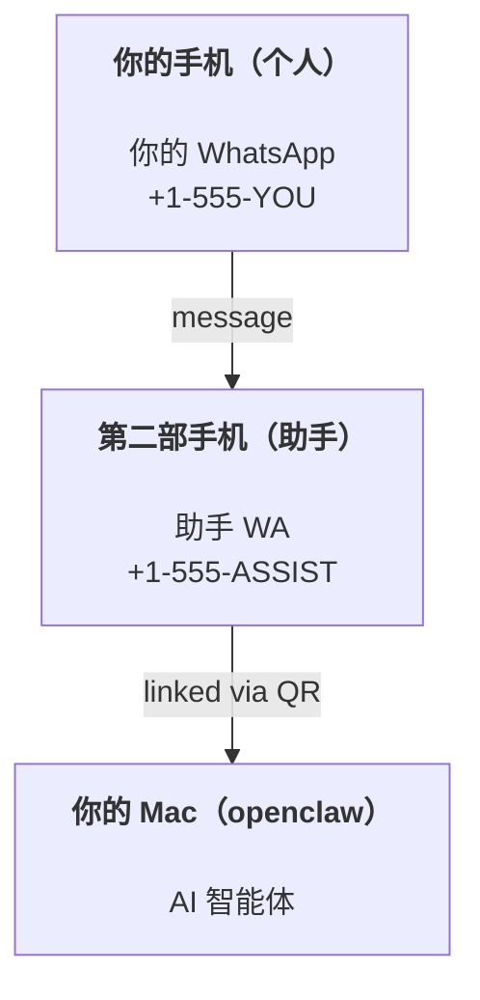

---
read_when:
    - 为新的助手实例执行新手引导
    - 审查安全 / 权限影响
summary: 将 OpenClaw 作为个人助手运行的端到端指南，并附带安全注意事项
title: 个人助手设置
x-i18n:
    generated_at: "2026-04-08T07:14:00Z"
    model: gpt-5.4
    provider: openai
    source_hash: 02f10a9f7ec08f71143cbae996d91cbdaa19897a40f725d8ef524def41cf2759
    source_path: start\openclaw.md
    workflow: 15
---

# 使用 OpenClaw 构建个人助手

OpenClaw 是一个自托管 Gateway 网关，可将 Discord、Google Chat、iMessage、Matrix、Microsoft Teams、Signal、Slack、Telegram、WhatsApp、Zalo 等连接到 AI 智能体。本指南介绍“个人助手”设置：一个专用的 WhatsApp 号码，将其作为你始终在线的 AI 助手使用。

## ⚠️ 安全第一

你正在让一个智能体处于能够执行以下操作的位置：

- 在你的机器上运行命令（取决于你的工具策略）
- 读取 / 写入你工作区中的文件
- 通过 WhatsApp / Telegram / Discord / Mattermost 及其他内置渠道向外发送消息

请从保守配置开始：

- 一定要设置 `channels.whatsapp.allowFrom`（绝不要在你的个人 Mac 上对全世界开放运行）。
- 为助手使用一个专用的 WhatsApp 号码。
- Heartbeats 现在默认每 30 分钟运行一次。在你信任这套设置之前，请通过设置 `agents.defaults.heartbeat.every: "0m"` 将其禁用。

## 前置条件

- 已安装并完成 OpenClaw 新手引导 —— 如果你还没做，请参见 [入门指南](/zh-CN/start/getting-started)
- 一个用于助手的第二电话号码（SIM / eSIM / 预付费卡）

## 双手机设置（推荐）

你需要这样的结构：



如果你把自己的个人 WhatsApp 连接到 OpenClaw，那么发给你的每一条消息都会变成“智能体输入”。这通常不是你想要的。

## 5 分钟快速开始

1. 配对 WhatsApp Web（会显示二维码；用助手手机扫描）：

```bash
openclaw channels login
```

2. 启动 Gateway 网关（让它保持运行）：

```bash
openclaw gateway --port 18789
```

3. 在 `~/.openclaw/openclaw.json` 中放入一个最小配置：

```json5
{
  gateway: { mode: "local" },
  channels: { whatsapp: { allowFrom: ["+15555550123"] } },
}
```

现在，用已列入允许列表的手机向助手号码发送消息。

新手引导完成后，我们会自动打开 Dashboard 并打印一个干净的（不含 token 的）链接。如果它提示需要认证，请将已配置的共享密钥粘贴到 Control UI 设置中。新手引导默认使用 token（`gateway.auth.token`），但如果你已将 `gateway.auth.mode` 切换为 `password`，也可以使用密码认证。之后如果想重新打开：`openclaw dashboard`。

## 为智能体提供一个工作区（AGENTS）

OpenClaw 会从其工作区目录中读取操作说明和“记忆”。

默认情况下，OpenClaw 使用 `~/.openclaw/workspace` 作为智能体工作区，并会在设置 / 首次运行智能体时自动创建它（以及初始的 `AGENTS.md`、`SOUL.md`、`TOOLS.md`、`IDENTITY.md`、`USER.md`、`HEARTBEAT.md`）。`BOOTSTRAP.md` 只会在工作区全新创建时生成（在你删除它之后，它不应该再次出现）。`MEMORY.md` 是可选的（不会自动创建）；如果存在，会在常规会话中加载。Subagent 会话只会注入 `AGENTS.md` 和 `TOOLS.md`。

提示：请把这个文件夹当作 OpenClaw 的“记忆”，并将其设为 git 仓库（最好是私有仓库），以便备份你的 `AGENTS.md` 和记忆文件。如果已安装 git，全新的工作区会自动初始化。

```bash
openclaw setup
```

完整工作区结构和备份指南： [智能体工作区](/zh-CN/concepts/agent-workspace)
记忆工作流： [记忆](/zh-CN/concepts/memory)

可选：通过 `agents.defaults.workspace` 选择不同的工作区（支持 `~`）。

```json5
{
  agent: {
    workspace: "~/.openclaw/workspace",
  },
}
```

如果你已经从某个仓库中提供了自己的工作区文件，可以完全禁用引导文件创建：

```json5
{
  agent: {
    skipBootstrap: true,
  },
}
```

## 让它变成“一个助手”的配置

OpenClaw 默认已经有一个不错的助手配置，但你通常还会希望进一步调整：

- 在 [`SOUL.md`](/zh-CN/concepts/soul) 中设置 persona / 指令
- thinking 默认值（如果需要）
- heartbeats（在你信任它之后）

示例：

```json5
{
  logging: { level: "info" },
  agent: {
    model: "anthropic/claude-opus-4-6",
    workspace: "~/.openclaw/workspace",
    thinkingDefault: "high",
    timeoutSeconds: 1800,
    // Start with 0; enable later.
    heartbeat: { every: "0m" },
  },
  channels: {
    whatsapp: {
      allowFrom: ["+15555550123"],
      groups: {
        "*": { requireMention: true },
      },
    },
  },
  routing: {
    groupChat: {
      mentionPatterns: ["@openclaw", "openclaw"],
    },
  },
  session: {
    scope: "per-sender",
    resetTriggers: ["/new", "/reset"],
    reset: {
      mode: "daily",
      atHour: 4,
      idleMinutes: 10080,
    },
  },
}
```

## 会话与记忆

- 会话文件：`~/.openclaw/agents/<agentId>/sessions/{{SessionId}}.jsonl`
- 会话元数据（token 用量、最近路由等）：`~/.openclaw/agents/<agentId>/sessions/sessions.json`（旧版位置：`~/.openclaw/sessions/sessions.json`）
- `/new` 或 `/reset` 会为该聊天开启一个全新会话（可通过 `resetTriggers` 配置）。如果单独发送，智能体会回复一条简短问候以确认重置。
- `/compact [instructions]` 会压缩会话上下文，并报告剩余的上下文预算。

## Heartbeats（主动模式）

默认情况下，OpenClaw 每 30 分钟运行一次 heartbeat，提示词为：
`Read HEARTBEAT.md if it exists (workspace context). Follow it strictly. Do not infer or repeat old tasks from prior chats. If nothing needs attention, reply HEARTBEAT_OK.`
将 `agents.defaults.heartbeat.every: "0m"` 设为禁用。

- 如果 `HEARTBEAT.md` 存在但实际上是空的（只有空行和 markdown 标题，例如 `# Heading`），OpenClaw 会跳过该次 heartbeat 运行，以节省 API 调用。
- 如果文件缺失，heartbeat 仍会运行，并由模型自行决定该做什么。
- 如果智能体回复 `HEARTBEAT_OK`（可选带少量填充；参见 `agents.defaults.heartbeat.ackMaxChars`），OpenClaw 会抑制该次 heartbeat 的出站投递。
- 默认情况下，允许将 heartbeat 投递到 `user:<id>` 这类私信目标。将 `agents.defaults.heartbeat.directPolicy: "block"` 设为阻止，可以在保持 heartbeat 运行的同时，抑制直接目标投递。
- Heartbeats 运行的是完整智能体轮次 —— 更短的间隔会消耗更多 token。

```json5
{
  agent: {
    heartbeat: { every: "30m" },
  },
}
```

## 媒体输入与输出

入站附件（图像 / 音频 / 文档）可以通过模板暴露给你的命令：

- `{{MediaPath}}`（本地临时文件路径）
- `{{MediaUrl}}`（伪 URL）
- `{{Transcript}}`（如果启用了音频转录）

来自智能体的出站附件：在单独一行中包含 `MEDIA:<path-or-url>`（不要有空格）。例如：

```
Here’s the screenshot.
MEDIA:https://example.com/screenshot.png
```

OpenClaw 会提取它们，并将其作为媒体与文本一起发送。

本地路径行为遵循与智能体相同的文件读取信任模型：

- 如果 `tools.fs.workspaceOnly` 为 `true`，出站 `MEDIA:` 的本地路径将被限制在 OpenClaw 临时根目录、媒体缓存、智能体工作区路径以及沙箱生成文件内。
- 如果 `tools.fs.workspaceOnly` 为 `false`，出站 `MEDIA:` 可以使用智能体本就有权读取的 host 本地文件。
- Host 本地发送仍然只允许媒体和安全文档类型（图像、音频、视频、PDF 和 Office 文档）。纯文本和类似秘密的文件不会被视为可发送媒体。

这意味着，当你的 fs 策略已经允许这些读取时，工作区之外生成的图像 / 文件现在也可以发送，而无需重新放开任意 host 文本附件外泄风险。

## 运维检查清单

```bash
openclaw status          # 本地状态（凭证、会话、排队事件）
openclaw status --all    # 完整诊断（只读、可直接粘贴）
openclaw status --deep   # 向 gateway 请求实时健康探测，并在支持时探测渠道
openclaw health --json   # gateway 健康快照（WS；默认可返回一个新鲜缓存快照）
```

日志位于 `/tmp/openclaw/` 下（默认：`openclaw-YYYY-MM-DD.log`）。

## 后续步骤

- WebChat： [WebChat](/zh-CN/web/webchat)
- Gateway 网关运维： [Gateway ??????](/zh-CN/gateway)
- Cron + 唤醒： [????](/zh-CN/automation/cron-jobs)
- macOS 菜单栏配套应用： [macOS 应用程序](/zh-CN/platforms/macos)
- iOS 节点应用： [iOS 应用](/zh-CN/platforms/ios)
- Android 节点应用： [Android 应用](/zh-CN/platforms/android)
- Windows 状态： [Windows（WSL2）](/zh-CN/platforms/windows)
- Linux 状态： [Linux 应用](/zh-CN/platforms/linux)
- 安全： [安全](/zh-CN/gateway/security)
